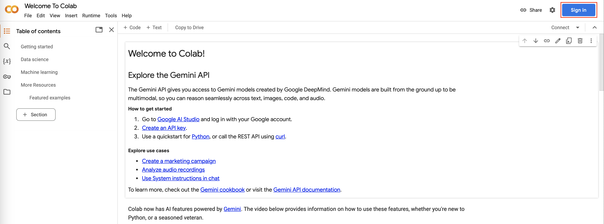
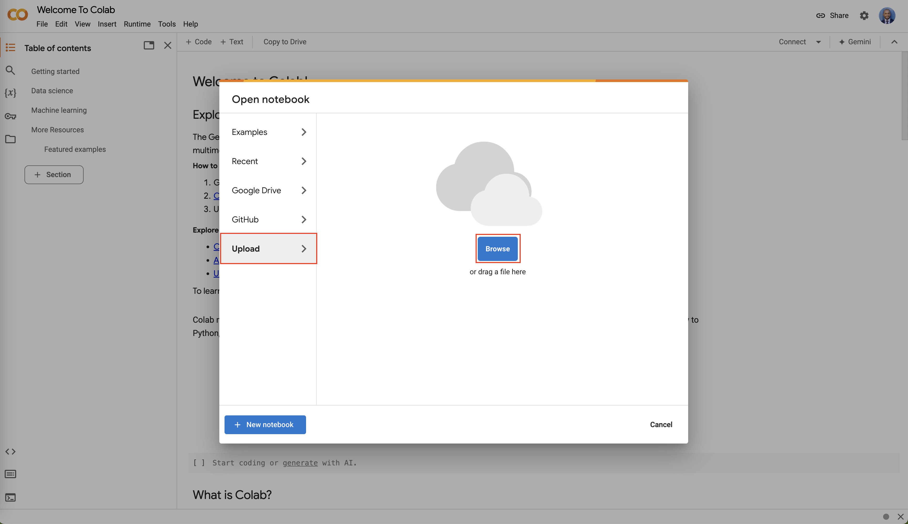
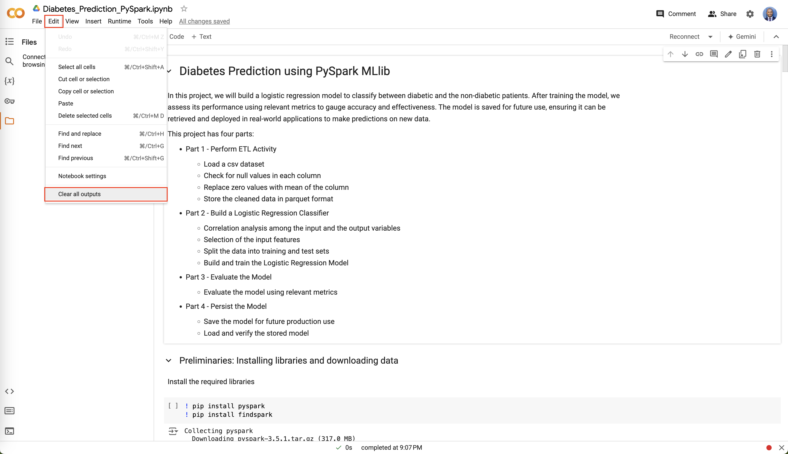
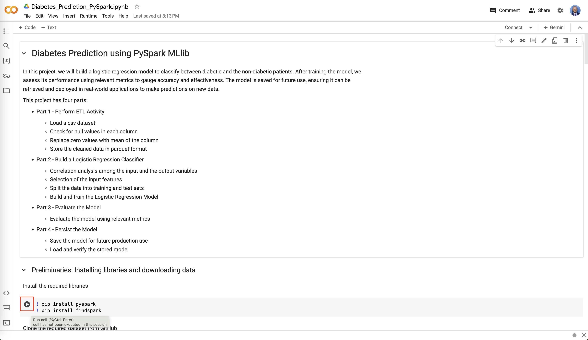

# Diabetes Prediction Project

## Disclaimer

This project demonstrates how to build a logistic regression model to classify between diabetic and non-diabetic patients using PySpark MLlib. The solution provided within the notebook is based on the **Coursera Project Network: [Diabetes Prediction With Pyspark MLLIB](https://www.coursera.org/learn/diabetes-prediction-with-pyspark-mllib)** project-based course on Coursera.

### Usage

* You are welcome to use this repository as a reference or starting point for your own project.

* If you choose to fork this repository, please ensure that you comply with the terms of the Apache License and give proper credit to the original authors.

## Project Overview

This project aims to predict diabetes using a Logistic Regression classifier built with PySpark MLlib.

## Objectives

* Perform ETL activity
* Build a Logistic Regression classifier
* Evaluate the model's performance
* Persist it for future use

## Datasets

For this project, we will use a modified version of the Pima Indians Diabetes Database (`diabetes.csv`), which is available in this [repository](https://github.com/pregismond/diabetes_dataset).

The original dataset can be found here: https://www.kaggle.com/datasets/uciml/pima-indians-diabetes-database

This dataset contains data exclusively from female patients. It includes various symptoms of diabetes, such as age, blood pressure, BMI, insulin levels, glucose levels, etc. The dataset also has an output class label with two possible values: 0 and 1. A value of 0 indicates that the patient is non-diabetic, while a value of 1 indicates that the patient has diabetes. Please note that this dataset and the model we train in this project are for educational purposes only and cannot be used in real-life applications.

## Directions

Google Colab is a free, cloud-based service provided by Google that allows you to write and execute Python code in a Jupyter Notebook directly from your browser. It requires no setup and offers free access to computing resources, including GPUs and TPUs, which are essential for machine learning and data science tasks.

Follow the steps below to execute the provided Jupyter Notebook for this project:

1. **Go to Google Colab**: Open your web browser and go to [Google Colab](https://colab.research.google.com/).

2. **Sign in**: If you aren't already signed in, use your Google account to sign in.

3. **Upload an existing notebook**:

    - On the `Open notebook` page, navigate to the `Upload` tab.
    - Browse and select the notebook you want to open.

4. **Clear All Outputs**:

    - Click on the `Edit` menu
    - Select `Clear all outputs` from the dropdown menu

5. **Start executing code**:

    - Click the "Play" button (triangle icon) on the left side of the cell or press ***Ctrl+Enter*** on your keyboard to run the cell.

## Learner

[Pravin Regismond](https://www.linkedin.com/in/pregismond)

## Acknowledgments

* Coursera Project Network © 2024 Coursera Inc. All rights reserved.
